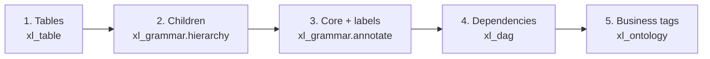
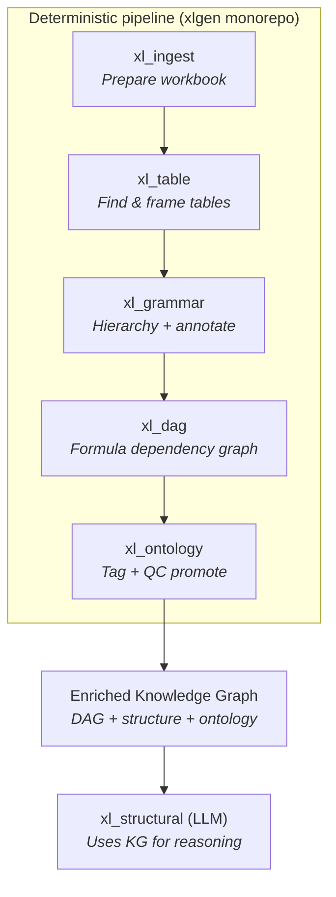
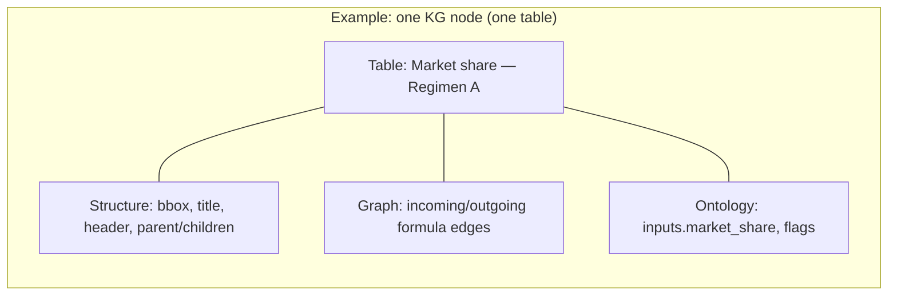
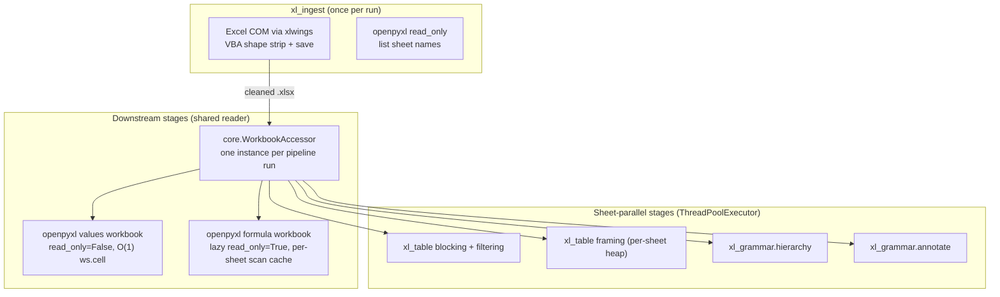

# Overall approach

## What we are building

**xlgen** turns a **Budget Impact Model (BIM)** or other **health economics (HE)** Excel workbook into a **Knowledge Graph (KG)** that software—and later, large language models (LLMs)—can reason about reliably.

The workbook is not treated as a flat grid of cells. We **structurally parse** it around one central idea:

> **Tables are the main unit of extraction and parsing.**

Everything else hangs off a table: its **core region** (the dense block of numbers and formulas the model actually calculates), its **children** when one visual block splits into several linked tables, and its **labels** (title, section headers, row names). The pipeline is deliberately staged so each concern is solved in order.

| Step | Where | What |
|------|--------|------|
| **Extract tables** | `xl_table` | Find rectangular table regions on each sheet (blocking → filtering → framing). |
| **Find children** | `xl_grammar.hierarchy` | Split or link **parent** tables and their **child** sub-tables on the same sheet. |
| **Core + labels** | `xl_grammar.annotate` | Locate the **formula/number core** (for DAG), then attach **titles**, **section/column headers**, and **row names** by walking outward from the core. |
| **Wire dependencies** | `xl_dag` | Parse formulas in each core and build the graph of table-to-table dependencies. |
| **Tag semantics** | `xl_ontology` | Apply BIM vocabulary (Inputs, Calculations, Results, concept IDs). |

On top of that structure we attach a **controlled vocabulary (ontology)** so each table can be labeled as Inputs, Calculations, Results, and finer concepts (for example market share, drug cost).

The **final knowledge graph** is an **enriched directed acyclic graph (DAG)**:

- **Each node** ≈ one logical table (or leaf table inside a hierarchy).
- **Each edge** ≈ a dependency between tables driven by **cell references in formulas** (e.g. a Results table pulling from an Inputs range).
- **Each node is enriched** with:
  - **Ontology tags** (role, subtype, concept identifiers),
  - **Structural context** from the workbook (title, header, row names, footnotes),
  - **Parent / sibling / child relationships** among tables on the same sheet (how HE models often split one visual block into several linked tables).

Downstream, a separate LLM layer (**xl_structural**, planned) will read this KG to answer questions, validate models, and assist analysts—without re-parsing the raw `.xlsx` every time.

---

## Five-stage pipeline (deterministic core)

Almost everything through ontology is **deterministic**: the same workbook always yields the same graph. No LLM runs in this core path.

**Reading the diagram:** work flows **top to bottom** through five packages. **xl_ontology** (plus its QC repair/promote substeps) produces the **enriched KG**. **xl_structural** sits **below** the KG as the consumer that uses it for language-driven tasks.

A separate optional stage, **xl_summarize**, can run LLM passes for cover-sheet confirmation and input-parameter repair; it is **not** part of the deterministic KG build.

---

## Stage summaries (non-technical)

| Stage | Plain name | What it does for the model |
|-------|------------|----------------------------|
| **xl_ingest** | Digest / prepare | Opens the BIM workbook, removes shapes and macros that confuse parsers, catalogs what was removed, and lists which sheets to process. |
| **xl_table** | Table detection | **Main extraction step:** finds table bounding boxes via blocking → filtering → framing. |
| **xl_grammar** | Structure & meaning | **Hierarchy:** parent/child table relationships. **Annotate:** core regions (for DAG), then titles, section headers, row names, notes. |
| **xl_dag** | Dependency graph | Reads formulas inside each table’s “core” and builds **nodes** (tables) and **edges** (cross-table cell dependencies). |
| **xl_ontology** | Business vocabulary | Tags each table with HE/BIM concepts (inputs vs results, etc.), runs quality checks, and promotes consistent titles/concepts. |
| **→ KG** | Knowledge graph | Merges the DAG with structural and ontology fields so each node is self-describing for tools and LLMs. |
| **xl_structural** *(planned)* | LLM layer | Consumes the KG to answer questions and assist analysts without re-scanning Excel. |

---

## What the knowledge graph contains (conceptual)

Think of three layers merged into one artifact:

1. **Graph layer (from xl_dag)** — Who depends on whom via formulas.
2. **Structure layer (from xl_table + xl_grammar)** — Where the table lives, its title/header, parent path, siblings/children.
3. **Semantics layer (from xl_ontology)** — BIM concept IDs, sheet roles, flags (e.g. internal vs user-facing inputs).

---

## Why this approach

| Benefit | Explanation |
|---------|-------------|
| **Repeatable** | HE models are regulated and versioned; deterministic parsing gives audit-friendly, reproducible outputs. |
| **Faithful to Excel** | Dependencies come from real formulas, not guesses from layout alone. |
| **LLM-ready** | The LLM receives a compact graph with stable IDs instead of millions of raw cells. |
| **Separation of concerns** | Structure and ontology are built without model calls; expensive LLM work runs only where needed (xl_structural, xl_summarize). |

---

## Technical summary

### Repository layout

Single monorepo **`xlgen`**; orchestration entry point: `core/pipeline_runner.run_fast_pipeline` (`ingest → table → hierarchy → annotate → dag → ontology → qc_repair → qc_promote`).

| Package | Key outputs under `data/output/<run_id>/` |
|---------|-------------------------------------------|
| `xl_ingest` | `ingest_output/cleaned_workbook.xlsx`, `approved_sheets.json` |
| `xl_table` | `table_output/` (blocking, filtering, framing artifacts) |
| `xl_grammar` | `hierarchy_output/`, `annotate_output/final_table_map.json` |
| `xl_dag` | `dag_output/dag.json`, `table_map_overview.json`, … |
| `xl_ontology` | `ontology_output/final_tagged_tables.json`, … |

Public JSON contracts for DAG artifacts: `docs/schemas/`.

### Parallelism and workbook access

- **Global worker cap:** `config/general.yaml` → `pipeline.max_workers`; effective workers = `min(cap, num_data_sheets)` via `core/pipeline_parallel.effective_max_workers`.
- **xl_ingest** is sequential and uses **COM** only for VBA/shape cleaning; sheet listing uses **openpyxl** briefly.
- **All later cell reads** go through **`WorkbookAccessor`**: values for content/merges/fonts; optional formula workbook for `is_formula` / `get_formula` and DAG/annotate formula graphs.
- **Thread safety:** one accessor per run; formula cache build is locked per sheet, then lockless lookups.

### KG composition (implementation)

- **DAG nodes/edges:** `xl_dag` reads `annotate_output/final_table_map.json` + workbook, emits `dag.json` (`DagNode`, `DagEdge`).
- **Enrichment:** hierarchy/annotate fields (parent_path, core bbox, titles, flags) and ontology tags (`final_tagged_tables.json`) align on stable `table_id` / `node_id` conventions (`{sheet_slug}__{table_id}__0`).
- **xl_structural:** not yet in this repo; documented here as the planned KG consumer.

### Configuration

- `config/stages.yaml` — per-stage thresholds (strict key matching into dataclasses).
- `config/general.yaml` — `pipeline_mode: fast|debug`, `pipeline.max_workers`, `fast_overrides`.
