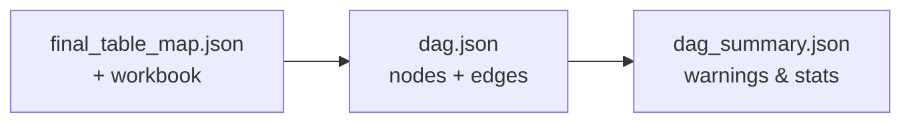
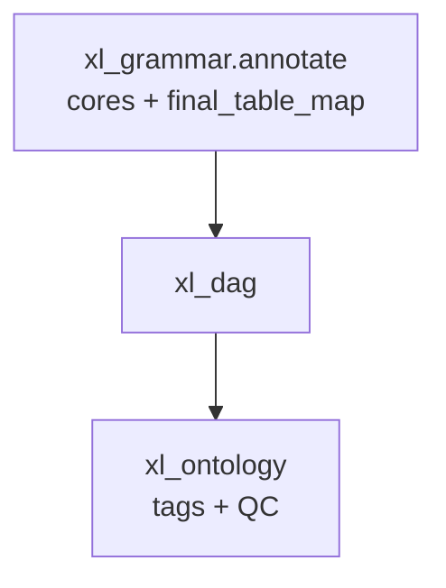

# xl_dag — formula dependency graph

## Purpose (non-technical)

After tables have **cores** and labels, we need to know how the **model calculates**: which table pulls values from which through Excel formulas.

**xl_dag** builds a **directed acyclic graph (DAG)**:

- **Node** ≈ one leaf table (with a validated core region).
- **Edge** ≈ “this table’s formulas reference cells in that table.”

This is the **graph layer** of the knowledge graph. It is faithful to Excel—not inferred from layout alone.

---

## What it does (plain language)

| Step | Meaning |
|------|---------|
| **Load table map** | Read annotated tables and each leaf’s core bbox. |
| **Parse formulas** | Inside each core, read formula text and detect references to cells, ranges, other sheets, named ranges. |
| **Build nodes** | One node per attachable table; store representative formulas and references. |
| **Build edges** | Link source table → target table when a formula points across tables. |
| **Flag issues** | Unresolved references (external workbook, INDIRECT, spill arrays, etc.) and **circular** formula loops are recorded, not silently dropped. |

**Parent-only navigation tables** (no calculation core of their own) produce **no DAG nodes**—they exist only to group children in the map.

---

## Why this matters for HE / BIM

- **Impact flows** (Inputs → Calculations → Results) can be traced automatically.
- **Audit** questions (“what drives this result cell?”) start from real references.
- **Ontology** and **LLM** stages consume the same stable `node_id` and edge list.

---

## Outputs

| File | Audience |
|------|----------|
| `dag.json` | Full graph: nodes, edges, named ranges, build stats |
| `table_map_overview.json` | High-level cards per table/sheet |
| `dag_summary.json` | Aggregates and warning banner |
| `node_index.json`, `formulas.json` | Backend indexes (optional) |

Contract details: `docs/schemas/`.

---

## Where xl_dag sits

---

## Technical summary

### Entry point

- `xl_dag` → `run_dag_analysis(run_id, output_base, config, ...)`

### Pipeline (high level)

1. `readers.py` — `final_table_map.json`, `summary.json`
2. `overview_builder.py` — `table_map_overview.json`
3. `node_builder.py` + `formula_parser.py` — per-leaf nodes, AST-shaped formula groups
4. `edge_builder.py` — resolve direct/range/cross-sheet/named-range refs; unresolved reasons preserved
5. `circular_detection.py` — `networkx.simple_cycles`
6. `exporter.py` — strict-order JSON writers

### IDs

- `node_id = {sheet_slug}__{table_id}__0`
- `edge_id = {source_node_id}__TO__{target_node_id}`
- Unresolved: `source_node_id = "__UNRESOLVED__{reason}"`

### Config

- `XlDagConfig` (9 fields) → `xl_dag` in `config/stages.yaml`

### Determinism

- No LLM; same inputs → same `dag.json`.
