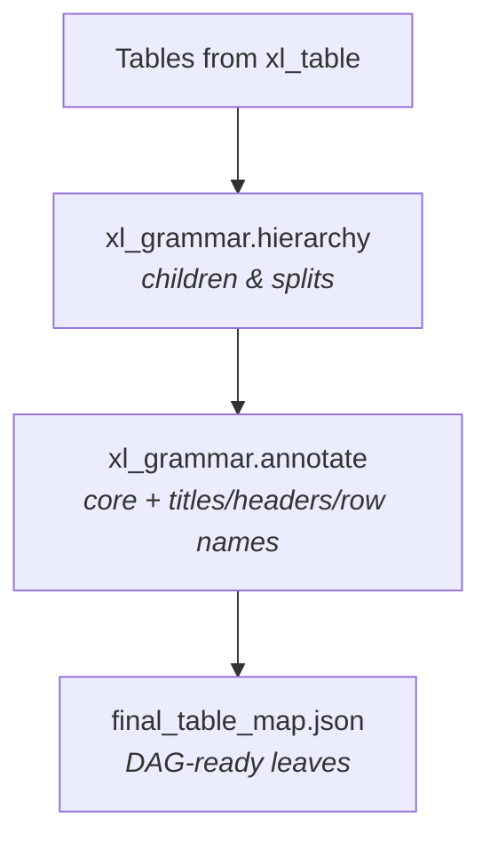
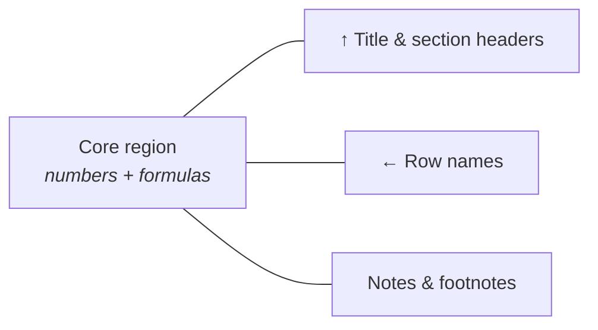

# xl_grammar — children, cores, and labels

## Purpose (non-technical)

Once **xl_table** has drawn table boundaries, **xl_grammar** answers two questions HE models care about:

1. **Hierarchy:** Does this table have **children**—smaller sub-tables nested under a parent on the same sheet?
2. **Annotation:** What are the human-readable parts around the data—**title**, **section/column headers**, **row names**, notes—and where is the **core** (the calculation block)?

The package has two cooperating parts:

| Part | Goal |
|------|------|
| **hierarchy** | Find **parent / child** (and sibling) relationships when one framed region should be split or linked structurally. |
| **annotate** | Find each table’s **core region**, then **annotate** titles, section headers, and row names by walking outward from that core. |

---

## Hierarchy — finding children of tables

**What:** Refine table structure: candidate **row-name**, **title**, **header**, and **footnote** regions; confirm **parent/child splits** when a parent bbox should yield child tables (using grammar-based cut detection from `xl_grammar.grammar_def`).

**Why:** HE sheets often show one composite layout—a block title, a header band, then several stacked sub-tables sharing row labels. Hierarchy records **who is parent and who is child** so downstream tools do not treat them as unrelated islands.

**Non-technical outcome:** A tree of tables per sheet, not just a flat list of boxes.

---

## Annotate — core first, then titles and headers

**What (order matters):**

1. **Core region detection** — Locate the connected block of **numbers and formulas** inside the table bbox. This **core** is what **xl_dag** later parses for dependencies.
2. **Validation** — Trim header-like or note-like rows wrongly included in the core.
3. **Upward walk** — Find **column/section headers** and **table title** above the core (including beside-header titles common in HEOR layouts).
4. **Leftward walk** — Find **row names** to the left of the core.
5. **Note scan** — Capture footnotes and notes to the right or below.
6. **Finalize** — Flatten to a **DAG-ready map** (`final_table_map.json`): standalone leaves and navigation-only parents.

**Why core-first:** Titles and headers are ambiguous if you start from the sheet edge. Anchoring on the **calculation core** keeps labels aligned with the data block the model actually uses.

**Non-technical outcome:** Each table carries structured metadata a person would recognize, plus a precise **core** bbox for formula graphing.

---

## What grammar does not do

| Task | Package |
|------|---------|
| First-pass table bbox discovery | `xl_table` |
| Cross-table formula edges | `xl_dag` |
| BIM concept tags (Inputs/Results) | `xl_ontology` |

Annotate **enriches** tables; it does **not** re-split the sheet from scratch.

---

## Outputs

| Artifact | From |
|----------|------|
| `hierarchy_results.json` | hierarchy |
| `tables.json`, `resolved_tables.json` | annotate |
| `final_table_map.json` | annotate finalize (input to xl_dag) |
| `summary.json` | annotate |

Under `data/output/<run_id>/hierarchy_output/` and `annotate_output/`.

---

## Technical summary

### Entry points

- `xl_grammar.hierarchy.runner.run_hierarchy(run_id, ...)`
- `xl_grammar.annotate.runner.run_annotate(run_id, ...)`

### hierarchy modules

- `table_processor.py`, `split_processor.py`, `sheet_coordinator.py`
- Cut detection: `xl_grammar/grammar_def/detector.py` (`XlGrammarConfig`)
- Config: `XlHierarchyConfig` → `xl_grammar_hierarchy` in YAML

### annotate pipeline (per table, parent before child)

- Row tagging (Layer 1 priors) → core detection → validation → upward / leftward walks → note scanner → `ResolvedTable` → optional `finalize_sheet`
- Shared `WorkbookAccessor`; optional formula view for `FORMULA` cell typing
- Config: `XlAnnotateConfig` → `xl_grammar_annotate` in YAML
- Sheet-parallel; `enable_finalize=true` writes `final_table_map.json`

### Key invariants

- `CoreRegion.bbox` uses **absolute** sheet coordinates; consumed row grids are **local** to table bbox.
- Parent entries in finalize are **navigation-only** (zero DAG nodes); leaves with cores are DAG-attachable.
- Fully **deterministic** (no LLM).

See also: `xl_grammar/approach.md` (engineer-oriented narrative).
