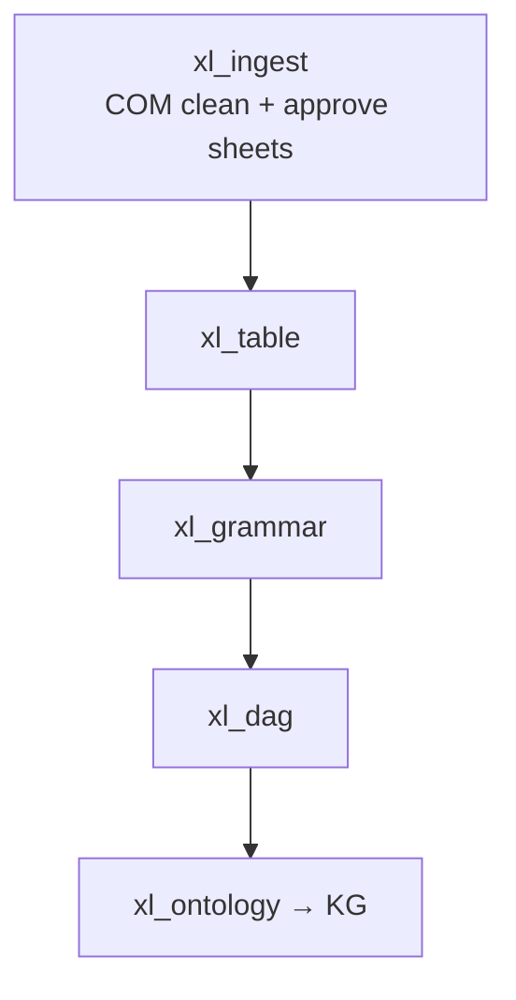

# xl_ingest — preparing the workbook

## Purpose (non-technical)

Before we can find tables or formulas, the BIM Excel file must be in a **clean, predictable shape**. The **xl_ingest** stage is that preparation step—sometimes called **digest** in pipeline diagrams.

It answers three practical questions:

1. **Is this a valid workbook we can process?** (`.xlsx` / `.xlsm`, file exists.)
2. **Can we strip visual clutter that breaks automated reading?** (embedded shapes, charts, images, grouped objects, legacy macros.)
3. **Which sheets should the rest of the pipeline read?** (All data sheets are approved by default; a catalog sheet records removed shapes.)

Nothing in this stage “understands” epidemiology or costs—it only **normalizes the file** so later stages see a stable grid.

---

## How we open Excel (and why it matters)

HE models are often **`.xlsm`** files with **VBA macros**, **grouped shapes**, and **charts** sitting on top of cells. A pure file reader can see cell values but may **miss or mis-handle**:

- Shapes and charts covering cells,
- Macro modules and OLE objects,
- Some save-time behaviors Excel applies when writing a new file.

For **shape and macro cleanup**, xl_ingest talks to **real Microsoft Excel** on Windows through **COM** (Component Object Model), using the **xlwings** Python library. Excel opens the workbook invisibly, a short **VBA macro** catalogs every shape, removes them, writes a **Shape_Info** sheet, and saves a **cleaned** copy.

For **lightweight tasks** (listing sheet names after cleaning), we use **openpyxl**, a Python library that reads the `.xlsx` package directly **without** starting Excel. That is faster and needs no desktop Excel for a simple sheet list.

---

## Why COM for cleaning, openpyxl afterward?

| Approach | Strengths | Limits |
|----------|-----------|--------|
| **COM (Excel + xlwings)** | Runs the same engine the analyst uses; can execute VBA, enumerate/delete **all** shape types, save a workbook Excel itself trusts. | Requires Excel installed (Windows or Mac with Excel); slower; not ideal for millions of cell reads. |
| **openpyxl** | Fast, headless, great for **reading/writing cells** and streaming large sheets; no Excel install required. | Does not execute VBA; shape/chart removal is incomplete compared to Excel-native automation. |

**Design choice:** use **COM once** at the boundary to produce a **cleaned_workbook.xlsx**, then use **openpyxl** (via shared `WorkbookAccessor` in later stages) for all heavy cell and formula work.

If VBA cleaning is turned off in config (`run_vba_cleaning: false`), ingest **copies** the input file through without COM—useful for workbooks that already have no shapes or for environments without Excel.

---

## What ingest produces

| Artifact | Meaning |
|----------|---------|
| `cleaned_workbook.xlsx` | Workbook after shape/macro cleanup (or copy-through). |
| `approved_sheets.json` | Sheet names downstream stages may read (excludes internal `Shape_Info` catalog). |
| `sheet_classification.jsonl` | Stub classification rows (deterministic pipeline; no LLM triage). |
| `shapes_manifest.jsonl` | Optional log of removed shapes (position, type, text) when enumeration succeeds. |

All paths live under `data/output/<run_id>/ingest_output/`.

---

## Where ingest sits in the pipeline

Every later stage reads **`cleaned_workbook.xlsx`**, not the original upload, so shape removal never has to be repeated.

---

## Technical summary

### Entry point

- `xl_ingest.api.run_xl_ingest(workbook_path, out_dir, config)`
- Config: `XlIngestConfig` — single flag `run_vba_cleaning: bool` (`config/stages.yaml` → `xl_ingest:`).

### Flow (`pipeline.py` + `api.py`)

1. `_validate_workbook` — existence, `.xlsx` / `.xlsm`.
2. `_run_vba_cleaning` → `tools/image_cleaner.run_macro_cleaning` **or** copy-through when `run_vba_cleaning=false`.
3. `_list_data_sheet_names` — `openpyxl.load_workbook(..., read_only=True)`, exclude `Shape_Info`.
4. `_write_minimal_classification_and_approved` — stub `sheet_classification.jsonl` + `approved_sheets.json` (all data sheets, `source: all_data_sheets`).

### COM / VBA path (`tools/image_cleaner.py`)

- `xlwings.App(visible=False)` → `books.open(input_path)`.
- Enumerate `sheet.shapes` into `shapes_data` (manifest).
- Inject `remove_shapes.vba` into `VBProject`, run macro `SaveAndRemoveAllShapes` (ungroup, catalog to **Shape_Info**, delete shapes), remove temp module, `wb.save` → copy to `ingest_output/cleaned_workbook.xlsx`.
- Macro source: `xl_ingest/remove_shapes.vba`.

### openpyxl usage in ingest

- **Sheet listing only** after clean (`_list_data_sheet_names`).
- Other modules under `xl_ingest/tools/` (cell matrix, formatting extractors) support optional/legacy tooling; the **minimal production path** does not require them for the fast pipeline.

### Downstream hand-off

- `core/pipeline_runner` passes `cleaned_workbook.xlsx` path into `run_table` and constructs `core.workbook_accessor.WorkbookAccessor` for grammar/DAG stages (openpyxl values + lazy formula caches)—**not** COM.

### Operational notes

- COM path is **Windows-oriented** (Excel process lifecycle, optional `taskkill` on locked temp files in `image_cleaner.py`).
- Ingest is **fully deterministic**; no LLM calls.
- Logs: `ingest_output/logs/xl_ingest.log`.
