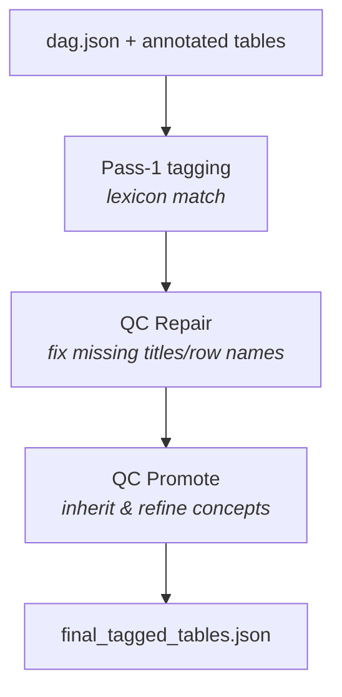
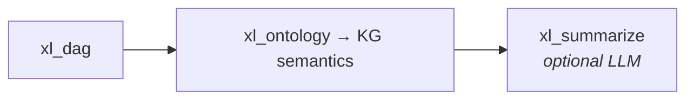

# xl_ontology — business vocabulary on tables

## Purpose (non-technical)

Structural parsing tells us **where** tables are and **how** they link by formulas. **xl_ontology** adds the **business meaning** HE reviewers expect:

- Is this table **Inputs**, **Calculations**, or **Results**?
- Which **BIM concept** does it match (market share, drug cost, epidemiology, …)?
- Should it appear in the **published** table list, or is it an internal/helper copy?

This is the **semantics layer** of the knowledge graph. It is **deterministic**—keyword lexicons and rules, not an LLM.

---

## The chained run (three substeps)

Orchestrator **Run xl_ontology** executes all three in order:

### 1. Pass-1 tagging

**What:** Each table is scored against controlled **lexicons** in `xl_ontology/packs/bim_v0/` (separate packs for Inputs, Calculations, Results sheets/concepts).

**Why:** Stable `concept_id` values (e.g. `inputs.market_share`) let downstream tools and LLMs speak the same language as the BIM methodology.

**Also:** Tables with **no outgoing DAG edges** may be flagged as potential **internal** copies (hidden scaffolding), with a **settings-rescue** when a overlapping “setting” node explains the pattern.

### 2. QC Repair (`xl_qc_repair`)

**What:** Deterministic fixes when metadata is thin—e.g. copy a **bold cell above** as title, or the **left cell** as row name when safe.

**Why:** Real models have imperfect layout; repair recovers obvious labels without manual Excel cleanup.

### 3. QC Promote

**What:** Four promotion rules—for example inherit a **parent title** to children, promote override triads, refine generic `structural_input` IDs using the title slug.

**Why:** Child tables and structural placeholders should inherit consistent concepts after repair.

---

## Outputs

| Artifact | Meaning |
|----------|---------|
| `ontology_table_tags.json` | Raw Pass-1 tags |
| `final_tagged_tables.json` | Consumer contract: tagged tables ready for KG / summarize |
| `qc_promote_changes.json` | Audit of promotion decisions |
| `qc_repair_output/` | Repaired map snapshots and traces |

Under `data/output/<run_id>/ontology_output/` and `qc_repair_output/`.

---

## Where ontology sits

After ontology, the **enriched knowledge graph** merges DAG edges + structure + tags.

---

## Technical summary

### Entry

- `xl_ontology.runner` — Pass-1; chained with `xl_qc_repair.runner.run_qc_repair` and `xl_ontology.qc_promote`

### Taggers (`xl_ontology/taggers/`)

- `InputsTagger`, `CalculationsTagger`, `ResultsTagger` — lexicon-driven, `OntologyTagger` base
- `pass1_apply.py` — fold verdicts back onto table records

### Packs

- `packs/bim_v0/ontology_bim_concepts/{branch}/{concept}/lexicon.json`
- `packs/bim_v0/ontology_bim_sheets/{type}/lexicon.json`

### Filters

- `internal_table_filter.py` — `potential_internal_table` via DAG fan-out
- `sheet_extra_filter.py` — sheet-level exclusions

### Config

- `XlOntologyConfig`, `xl_qc_repair` section in `config/stages.yaml`

### Determinism

- No LLM in ontology or QC chain (May 2026 cleanup).
