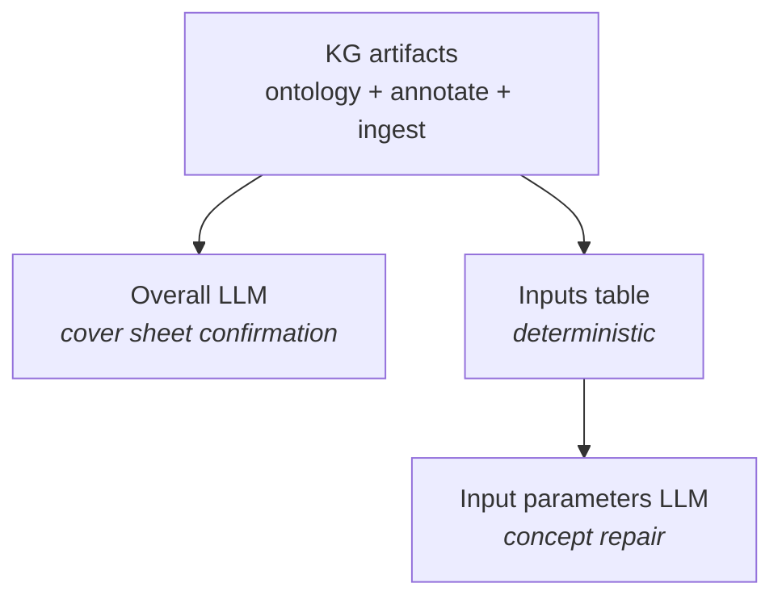

# xl_summarize — LLM confirmation and input tables

## Purpose (non-technical)

Everything through **xl_ontology** is **deterministic**—repeatable, auditable, no model calls. **xl_summarize** is the **optional LLM stage** for tasks that need human-language judgment on top of the knowledge graph:

- Confirming **overall model metadata** from cover/intro sheets.
- Building a structured **input parameter table** for analysts.
- **Repairing** ambiguous input concept IDs by reading the workbook with a code interpreter.

xl_summarize does **not** rebuild the DAG or re-detect tables; it **reads** ontology + annotate artifacts and the cleaned workbook.

---

## Three independent capabilities

| Capability | LLM? | Output | Use |
|------------|------|--------|-----|
| **Overall summary** | Yes | `final_overall.json` | Validate model title, indication, horizon, etc. from intro/cover content |
| **Input table** | No | `final_input_table.json` | List input rows with `concept_id`, Excel refs, flags—from Pass-1 tags + finalize map |
| **Input parameters repair** | Yes | `final_input_table_llm.json` | Fix rows whose concept is not one of 13 canonical BIM input concepts |

You can run any one without the others (orchestrator exposes separate buttons).

---

## How the LLM accesses Excel

- Uses OpenAI **Responses API** with **code interpreter**.
- The cleaned workbook is attached via **container file IDs** (not pasted cell dumps)—avoids truncation traps on large models.
- Input-parameters repair issues **one batched** call to read `Sheet!Range` contexts and assign concepts or `keep`.

---

## Relationship to xl_structural

| Stage | Role |
|-------|------|
| **xl_summarize** | Targeted BIM workflows: overall confirmation + input inventory |
| **xl_structural** *(planned)* | Broader reasoning over the full **knowledge graph** |

Both are LLM consumers; summarize is **product-specific**, structural is **graph-wide**.

---

## Outputs

Under `data/output/<run_id>/summarize_output/`:

- `final_overall.json`
- `final_input_table.json`
- `final_input_table_llm.json`
- Stage folders `01_prep/` … `04_harvest/` when running Overall (debug trail)

---

## Technical summary

### Entry points (`xl_summarize/runner.py`)

- `run_xl_summarize_overall` — prep → upload → respond → harvest
- `run_xl_summarize_inputs` — deterministic; `stages/inputs.py`
- `run_xl_summarize_input_parameters` — `stages/input_params_llm.py`; consolidated ids `inputs.<concept>.<section>[.<subsection>]`

### Config

- `XlSummarizeConfig` — `config/stages.yaml` + env for API keys (`core.env_bootstrap`)

### Upstream reads

- `final_tagged_tables.json`, `final_table_map.json`, `cleaned_workbook.xlsx`, `ontology_table_tags.json`

### Helpers

- `client.py`, `container.py`, `stages/harvest.py` (`parse_model_rows`, `_extract_message_text`)

### Not part of fast pipeline

- `run_fast_pipeline` stops after ontology/QC; summarize is **manual / orchestrator-triggered**.
