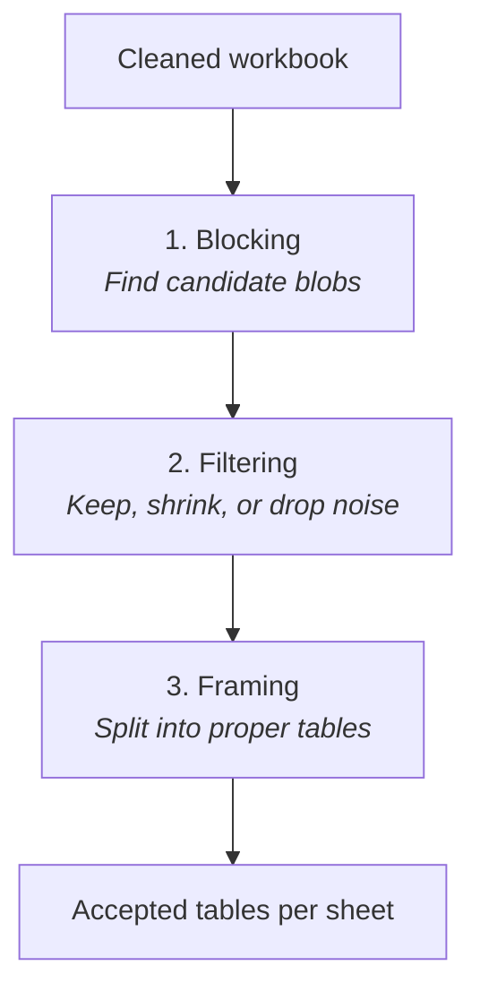
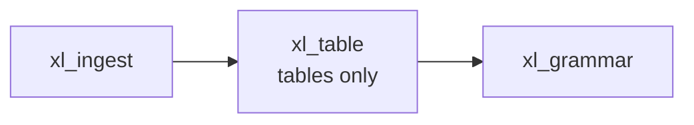

# xl_table — finding tables on the sheet

## Purpose (non-technical)

**Tables are the main unit we extract from a BIM workbook.** Before we can tag “Inputs” or trace formulas, we must answer: *where does each table start and end on the sheet?*

**xl_table** does that in **three passes**, each with a clear job. Together they turn a messy grid into a list of **stable table regions** (bounding boxes) that every later stage trusts.

---

## The three passes (why we do each)

### 1. Blocking — “Where might data live?”

**What:** Scan each sheet for **connected regions** of non-empty cells (like flood-filling islands on the grid). Small gaps can be **bridged** so a single HE block does not fragment into dozens of slivers.

**Why:** Analysts rarely draw explicit borders. Blocking finds **candidate blobs** without guessing titles or formulas yet—fast, sheet-wide discovery.

### 2. Filtering — “Is this blob a real table?”

**What:** Score each candidate (size, density, shape). **Keep** good ones, **shrink** bloated boxes that swallowed blank margins, **reject** slivers and junk. Near-duplicates are **consolidated**.

**Why:** Blocking is generous; filtering removes false positives (notes columns, stray labels, duplicate overlaps) so framing does not waste effort.

### 3. Framing — “One blob, one or more tables?”

**What:** Take surviving candidates and **structurally split** them along natural seams (row/column gaps, entropy changes, grammar-style cuts). Each final piece becomes a **table object** with a tight bounding box. Large regions may become **several** tables.

**Why:** A single visual “block” on an HE sheet often contains multiple logical tables stacked or side by side. Framing is where we **commit** to the table list the rest of the pipeline uses.

> **Note:** “Framing” here means **structural table framing**, not Excel cell formatting (fonts/colors).

---

## What xl_table does *not* do (yet)

These belong to **xl_grammar**, not xl_table:

| Later in pipeline | Package |
|-------------------|---------|
| **Core region** (formula/number block for DAG) | `xl_grammar.annotate` |
| **Parent / child** table relationships | `xl_grammar.hierarchy` |
| **Titles, headers, row names** | `xl_grammar.annotate` |

xl_table’s job ends at **reliable table boundaries**.

---

## Outputs (plain language)

| Artifact | Meaning |
|----------|---------|
| `candidate_rows.jsonl` | Candidates after blocking + filtering (audit trail). |
| `structural_tables.json` | Final tables with coordinates per sheet. |
| `accepted_tables.json` | Consumer-friendly list of accepted table ranges. |
| `rejected_blocks.jsonl` | What was filtered out (when enabled). |

Paths: `data/output/<run_id>/table_output/blocking_filtering/` and `.../framing/`.

---

## Where xl_table sits

---

## Technical summary

### Entry point

- `xl_table.runner.run_table(input_workbook, output_path, ...)`
- Order: **blocking → filtering → framing** (single orchestrated call).

### Blocking (`xl_table/blocking/`)

- Shared `WorkbookAccessor` → presence matrix → connected-component **block generation** (CC + bridge).
- Per-sheet parallel via `ThreadPoolExecutor` (`_blocking_filtering_orchestrator.py`).

### Filtering (`xl_table/filtering/`)

- Multi-pass heuristics: evaluate / shrink / reject; **consolidation** dedupes near-duplicate bboxes.
- Config: `Config` in `xl_table/models.py` (`config/stages.yaml` → `xl_table_blocking`).

### Framing (`xl_table/framing/`)

- Per-sheet **MaxHeap** of bboxes → `propose_splits_structural` → metrics → `qc_gate` → split or `finalize` → `TableObject`.
- Sheet-parallel workers; deterministic merge of `decisions.jsonl` in alphabetical sheet order.
- Config: `XlTableConfig` in `xl_table/framing/config.py` (`xl_table_framing` in YAML).

### Parallelism

- Blocking + filtering and framing both respect `general.yaml` → `pipeline.max_workers` (`core.pipeline_parallel.effective_max_workers`).

### Downstream

- `xl_grammar.hierarchy` and `xl_grammar.annotate` consume table/hierarchy artifacts; **core regions** are detected in annotate, not in xl_table.
